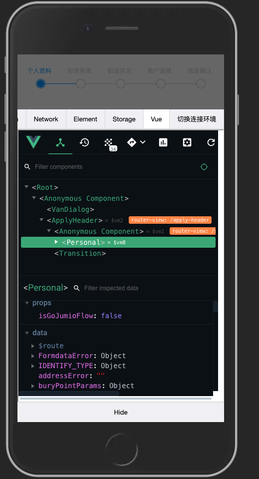

## 一个vconsole插件

如下图所示


## 可以使用的功能
- 可以显示当前url
- 可以进行环境的切换
- 可以Reload当前页面

## 使用方法
```shell
npm install yl-vconsole-plugin -S

yarn add yl-vconsole-plugin
```

```js
import VConsole from 'vconsole';
import VConsoleYlPlugin from 'yl-vconsole-plugin';
const vConsole = new VConsole();
const plugin = new VConsoleYlPlugin(vConsole);
```

## 项目里的使用方法：
```js
import domain from '@/utils/DOMAIN'

// jsBridge插件
export default {
    async install(Vue, { use_console = true } = { use_console: true }) {
        // 异步导入控制台
        if (
            use_console &&
            !domain.IS_PRO &&
            !domain.IS_PRO_HK &&
            !domain.IS_USMART
        ) {
            const { default: VConsole } = await import(
                /*webpackChunkName: "VConsole"*/ 'vconsole'
            )
            const { default: VConsoleYlPlugin } = await import(
                /*webpackChunkName: "yl-vconsole-plugin"*/ 'yl-vconsole-plugin'
            )
            const vconsole = new VConsole()
            window.VConsole = VConsole
            new VConsoleYlPlugin(vconsole)
        }
    }
}

```

## vue-devTools接入vconsole方法
### 安装一个插件vue-vconsole-devtools
原理可参考掘金这篇文章：
- https://juejin.cn/post/6949433236787298335
- github: https://github.com/Zippowxk/vue-vconsole-devtools
### 项目里的接入方法：
```js
import domain from '@/utils/DOMAIN'
// jsBridge插件
export default {
    async install(Vue, { use_console = true } = { use_console: true }) {
        // 异步导入控制台
        if (
            use_console &&
            !domain.IS_PRO &&
            !domain.IS_PRO_HK &&
            !domain.IS_USMART
        ) {
            const { default: VConsole } = await import(
                /*webpackChunkName: "VConsole"*/ 'vconsole'
            )
            console.log('VConsole ===》', VConsole)
            const { default: VConsoleYlPlugin } = await import(
                /*webpackChunkName: "yl-vconsole-plugin"*/ 'yl-vconsole-plugin'
            )
            const { default: Devtools } = await import(
                /*webpackChunkName: "vue-vconsole-devtools"*/ 'vue-vconsole-devtools'
            )
            console.log('Devtools=====>', Devtools)
            const vconsole = new VConsole()
            window.VConsole = VConsole
            Vue.config.devtools = true
            window.__VUE_DEVTOOLS_GLOBAL_HOOK__.emit('init', Vue)
            Devtools.initPlugin(vconsole)
            new VConsoleYlPlugin(vconsole)
        }
    }
}
```
如下图所示

